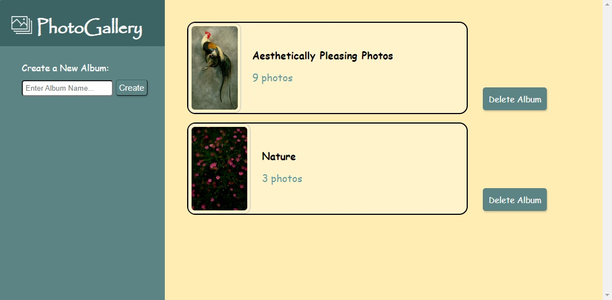
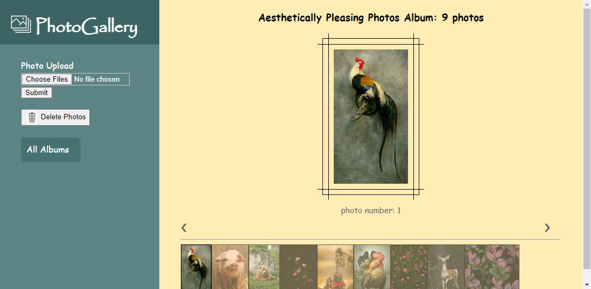

# ReactJS-PhotoGallery-express-fileupload (<font size='3'> V1 </font>)

#### By _**Mahashi-github**_

#### This is a ReactJS, Node.js & MongoDB application. You can employ this app to create albums with specific names to categorize photos by subject and upload photos to albums to get albums with photos sorted by number. You can also select and delete photos.

## Technologies Used
* _ReactJS_
* _React-router-dom (Outlet, useLoaderData, useRouteError )_
* _React-Hooks (useContext, useEffect, useState)_
* _jsx_
* _html_
* _css_
* _javascript_
* _node.js_
* _express_
* _express router & MVC_
* _mongoose_
* _mongodb embedded/nested documents_
* _express-fileupload_
* _uuid_

## Setup
This react app is created by 'npm create vite@latest directoryName'.

Inside the frontend directory:
```
$ npm install
$ npm run dev
```
Inside the backend directory:
```
$ npm install
$ nodemon app
```

## Screenshots of the Application
<p>
  
  
</p>